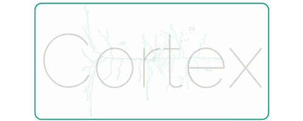

# Cortex

Cortex is a powerful platform designed for data governance and cataloging. It aims to provide organizations with a comprehensive solution to manage and maintain their data assets effectively.

## Features

- Automated data discovery and cataloging
- Metadata extraction and indexing using Elasticsearch
- Data lineage and dependency tracking
- Data quality assessment and monitoring
- Access control and security management
- User-friendly web interface for data exploration and search
- RESTful API for integration with other systems

## Architecture

Cortex follows a modular architecture, consisting of the following main components:

- **Cortex Backend**: Written in Go, the backend handles data ingestion, metadata extraction, and communication with Elasticsearch for indexing and searching.
- **Cortex Frontend**: Built with Next.js and React, the frontend provides a intuitive user interface for data exploration, search, and governance tasks.
- **Elasticsearch**: Used as the primary data store for metadata and search capabilities.

## Getting Started

To get started with Cortex, follow these steps:

1. Clone the repository:

   ```
   git clone https://github.com/your-username/cortex.git
   ```

2. Set up the backend:

   - Configure Elasticsearch connection in `config.go`
   - Build and run the backend:
     ```
     cd cortex-backend
     go build
     ./cortex-backend
     ```

3. Set up the frontend:

   - Install dependencies:
     ```
     cd cortex-frontend
     npm install
     ```
   - Start the development server:
     ```
     npm run dev
     ```

4. Access the Cortex web interface at `http://localhost:3000`

## Configuration

Cortex can be configured through the following files:

- `cortex-backend/config.go`: Backend configuration, including Elasticsearch connection details.
- `cortex-frontend/next.config.js`: Frontend configuration, including API endpoints.

## Contributing

Contributions to Cortex are welcome! If you find any issues or have suggestions for improvements, please open an issue or submit a pull request.

## License

Cortex is open-source software licensed under the [MIT License](LICENSE).

---

Feel free to customize the README further based on your project's specific details, such as adding more sections for documentation, deployment instructions, or acknowledgements.
