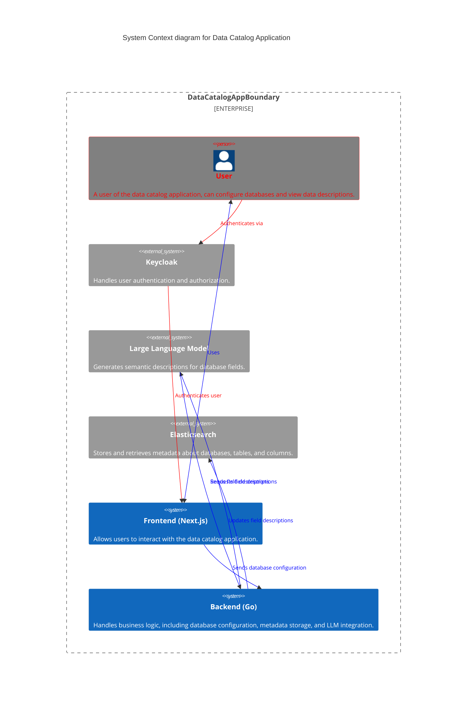

# C4

```mermaid
C4Context
  title System Context diagram for Data Catalog Application
  Enterprise_Boundary(b0, "DataCatalogAppBoundary") {
    Person(user, "User", "A user of the data catalog application, can configure databases and view data descriptions.")
    
    System_Ext(keycloak, "Keycloak", "Handles user authentication and authorization.")
    System_Ext(LLM, "Large Language Model", "Generates semantic descriptions for database fields.")
    System_Ext(elasticsearch, "Elasticsearch", "Stores and retrieves metadata about databases, tables, and columns.")
    
    System(frontend, "Frontend (Next.js)", "Allows users to interact with the data catalog application.")
    System(backend, "Backend (Go)", "Handles business logic, including database configuration, metadata storage, and LLM integration.")
    
    BiRel(user, frontend, "Uses")
    Rel(frontend, backend, "Sends database configuration")
    Rel(backend, elasticsearch, "Stores/Retrieves metadata")
    Rel(backend, LLM, "Requests field descriptions")
    Rel(LLM, backend, "Sends field descriptions")
    Rel(backend, elasticsearch, "Updates field descriptions")
    Rel(user, keycloak, "Authenticates via")
    Rel(keycloak, frontend, "Authenticates user")
  }
  
  UpdateElementStyle(user, $fontColor="red", $bgColor="grey", $borderColor="red")
  UpdateRelStyle(user, frontend, $textColor="blue", $lineColor="blue")
  UpdateRelStyle(frontend, backend, $textColor="blue", $lineColor="blue")
  UpdateRelStyle(backend, elasticsearch, $textColor="blue", $lineColor="blue")
  UpdateRelStyle(backend, LLM, $textColor="blue", $lineColor="blue")
  UpdateRelStyle(LLM, backend, $textColor="blue", $lineColor="blue")
  UpdateRelStyle(backend, elasticsearch, $textColor="blue", $lineColor="blue", $offsetY="-10")
  UpdateRelStyle(user, keycloak, $textColor="red", $lineColor="red")
  UpdateRelStyle(keycloak, frontend, $textColor="red", $lineColor="red")
  
  UpdateLayoutConfig($c4ShapeInRow="3", $c4BoundaryInRow="1")
```