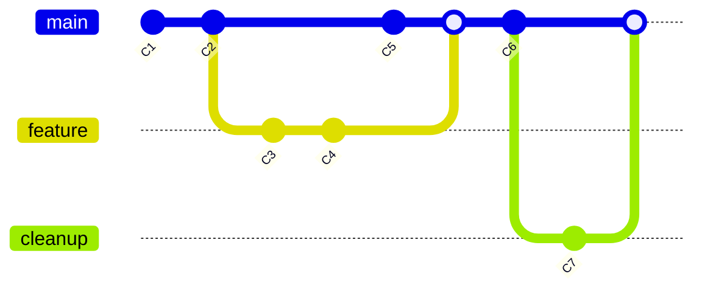

# git flow
- Use github flow

# GitHub Flow

Follow the GitHub flow for collaborating on projects.

## In this article

- Introduction
- Prerequisites
- Following the GitHub Flow

### Introduction

The GitHub flow is a lightweight, branch-based workflow. It is useful for everyone, not just developers. For example, at GitHub, we use the GitHub flow for our site policy, documentation, and roadmap.

### Prerequisites

To follow the GitHub flow, you need a GitHub account and a repository. For information on creating an account, see "Creating a GitHub account". To create a repository, see "Quickstart for repositories". To find an existing repository to contribute to, see "Finding ways to contribute to open source on GitHub".

### Following the GitHub Flow

**Create a branch:**

Create a branch in your repository. A short, descriptive branch name lets your collaborators quickly see what work is in progress. Examples: `increase-test-timeout` or `add-code-of-conduct`. See more at "Creating and deleting branches within your repository".

**Make changes:**

On your branch, make any desired changes to the repository. See more at "Creating files", "Editing files", "Renaming a file", "Moving a file to a new location", or "Deleting files in a repository".

**Commit and push changes:**

Commit and push the changes on your branch. Give each commit a descriptive message. Examples: `fix typo` or `increase rate limit`.

**Create a pull request:**

Create a pull request to ask your collaborators for feedback on your changes. The pull request review is so valuable that some repositories require an approval review before pull requests can be merged. If you want feedback or advice before finalizing your changes, you can mark your pull request as a draft. See more at "How to create a pull request".

**Address review comments:**

Reviewers will leave questions, comments, and suggestions. You can continue to commit and push changes in response to the reviews. Your pull request will automatically update.

**Merge your pull request:**

After your pull request is approved, merge your pull request. This will automatically merge your branch so that your changes appear in the default branch. GitHub keeps the history of comments and commits in the pull request to help future contributors understand your changes. See more at "Merging a pull request".

**Delete your branch:**

After merging your pull request, delete the branch. This indicates that the work on the branch has been completed. See more at "Deleting and restoring branches in a pull request".

This flow helps keep work organized and facilitates collaboration on projects on GitHub.
REFERENCE: [githubflow](https://docs.github.com/pt/get-started/using-github/github-flow)